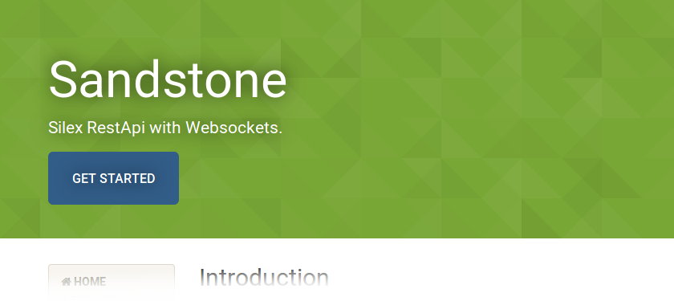

# Sandstone

[](https://travis-ci.org/eole-io/sandstone)
[](https://packagist.org/packages/eole/sandstone)
[](https://scrutinizer-ci.com/g/eole-io/sandstone/?branch=master)
[](https://insight.sensiolabs.com/projects/914c7d8f-a51a-4146-b211-44bcf81f5b48)
[](https://packagist.org/packages/eole/sandstone)


PHP microframework designed to build a RestApi
working together with a **websocket server**.

Build a real time RestApi!

### :speech_balloon: New (18 April 2018)

I opened a chat channel where you can get help, give feedback, and talk about Sandstone (Mattermost instance):

:speech_balloon: https://framateam.org/sandstone :speech_balloon:


## Install

``` bash
composer require eole/sandstone
```


## Usage

### Create a Sandstone application

Sandstone is a Silex application with websockets:

``` php
$app = new Eole\Sandstone\Application();
```

### Declare a websocket topic

Just as easy as declaring a silex route:

``` php
$app->topic('chat/{channel}', function ($topicPattern, $arguments) {
    $channelName = $arguments['channel'];

    return new ChatTopic($topicPattern, $channelName);
});
```

See [ChatTopic class here](https://eole-io.github.io/sandstone-doc/examples/multichannel-chat).


### Send push notifications

When an endpoint is called on the RestApi, i.e `POST /api/articles` and update a resource,
you can send a push notification to notify this update.

On the RestApi stack:

``` php
use Symfony\Component\HttpFoundation\Response;

$app->post('api/articles', function () use ($app) {
    // Dispatch an event on article creation
    $app['dispatcher']->dispatch('article.created', new ArticleEvent());

    return new Response([], 201);
});

// Send all 'article.created' events to push server
$app->forwardEventToPushServer('article.created');
```

Then on the websocket stack:

``` php
use Symfony\Component\EventDispatcher\EventSubscriberInterface;
use Eole\Sandstone\Websocket\Topic;

class MyWebsocketTopic extends Topic implements EventSubscriberInterface
{
    public static function getSubscribedEvents()
    {
        return [
            'article.created' => 'onArticleCreated',
        ];
    }

    public function onArticleCreated(ArticleEvent $event)
    {
        $this->broadcast([
            'message' => 'An article has just been published: '.$event->title,
        ]);
    }
}
```


## Examples

Working examples from scratch:

- [RestApi + Websocket + push notification](https://eole-io.github.io/sandstone-doc/examples/full)
- [Authentication on RestApi and Websockets](https://eole-io.github.io/sandstone-doc/authentication)
- [Chat example](https://eole-io.github.io/sandstone-doc/examples/multichannel-chat)


## Documentation

[See the full documentation here](https://eole-io.github.io/sandstone-doc/)

[](https://eole-io.github.io/sandstone-doc/)


## Sandstone edition

You're planning to start a new real-time Rest Api application based on Sandstone?

You may be interested by Sandstone edition.

It already integrates a Sandstone application with a docker environment, a database, debug tools...

[Get started with Sandstone edition](https://eole-io.github.io/sandstone-doc/edition/get-started).


## Misc

Articles about Sandstone:

- [Sandstone explained to NodeJS, Python or PHP users](https://alcalyn.github.io/sandstone-explained-nodejs-python-php-users/)
- [Creating a poker planning application with PHP and websockets](https://alcalyn.github.io/poker-planning-php-websockets/)
- [What is Sandstone, What can I do with Sandstone](https://alcalyn.github.io/projects/sandstone/)

Big picture: https://eole-io.github.io/sandstone-doc/big-picture


## Changelog

See [Releases page](https://github.com/eole-io/sandstone/releases).


## License

This library is under [MIT License](LICENSE).
