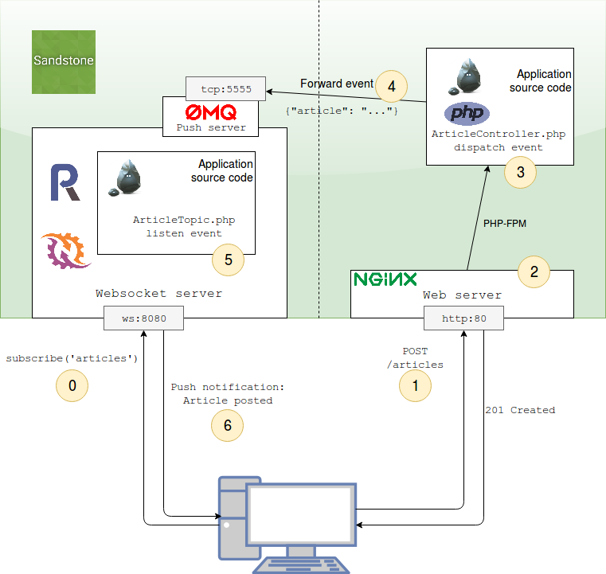

<h1 class="no-margin-top">Big picture</h1>

Sandstone runs a RestApi server and a Websocket server.
Two stacks, running on differents processus.

This big picture show all Sandstone components, and list all steps
in a standard use case, a RestApi request which triggers a Push event.

### Step 0

Javascript client opens a connection to websocket server.
It then subscribes to `articles` topic in order to receive
all new published articles as soon as someone posted one.

> See `ChatTopic` class, or Javascript client implementation example in
> [Full example]({{ site.baseurl }}/examples/multichannel-chat.html).

### Step 1

A web client creates a new article. He then POST it to the RestApi server.

### Step 2

Nginx handle the HTTP request, and asks for php-fpm to execute PHP application.
to return processed result.

### Step 3

PHP runs the application. In Sandstone, it means:

 - solve the `POST /articles` route,
 - execute the `ArticleController`,
 - persist the article in database,
 - dispatch an `ARTICLE_CREATED` event through the Event Dispatcher.

### Step 4

If the `ARTICLE_CREATED` event has been marked as *forward* with
`$app->forwardEventToPushServer('ARTICLE_CREATED');`,
Sandstone will *automagically* forward it to the websocket server process.

The magic trick here is to use a ZMQ socket. Sandstone serialize the event,
send it through the ZMQ socket. The websocket process then deserialize it,
and dispatch it in his Event dispatcher.

By this way, dispatching an event in the RestApi stack
can be listened in the websocket stack.

### Step 5

Your `ArticleTopic`, which is listening to the `ARTICLE_CREATED` event,
calls the listener. This listener will JSON serialize the article, and `broadcast` the event
to the `articles` websocket topic.

> See `ChatTopic` class to see how to listen to event:
> [Full example]({{ site.baseurl }}/examples/multichannel-chat.html).

### Step 6

The Javascript client, which earlier (step 0) subscribed to the `articles` websocket topic,
receives the JSON serialized event.

It can use this event to real-time display a notification
that a new article has been posted,
or dynamically add it to the DOM.
