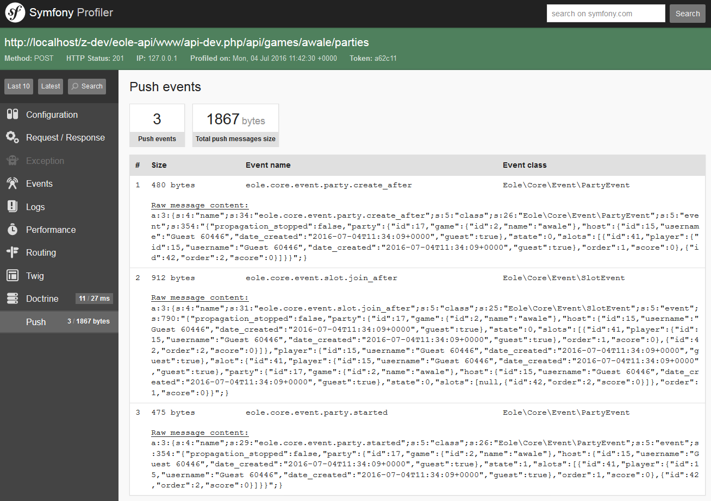

<h1 class="no-margin-top">Push debug profiler</h1>

Sandstone integrates a development tool, the push debug profiler.

It logs all messages that has been sent to the websocket server
during call to the rest api.




## Enable the push debug profiler

Just register the profiler by adding:

``` php
$app->register(new Eole\Sandstone\Push\Debug\PushServerProfilerServiceProvider());
```

where `$app` is your Sandstone instance.

> **Note**:
> It assumes you have
> [installed the Symfony profiler](https://github.com/silexphp/Silex-WebProfiler)
> in your Silex installation.


## Usage

Once registered, a "Push" panel should appear in `/_profiler`.

This panel logs all messages with their content, size, event class and event name.

> **Note**:
> Just refreshing an old panel won't work.
> You must make a new request, then open it in with the profiler
> to see the "Push" panel.

Another note: There is no icon for the Push panel, I didn't find one, so if you have an idea... :D
